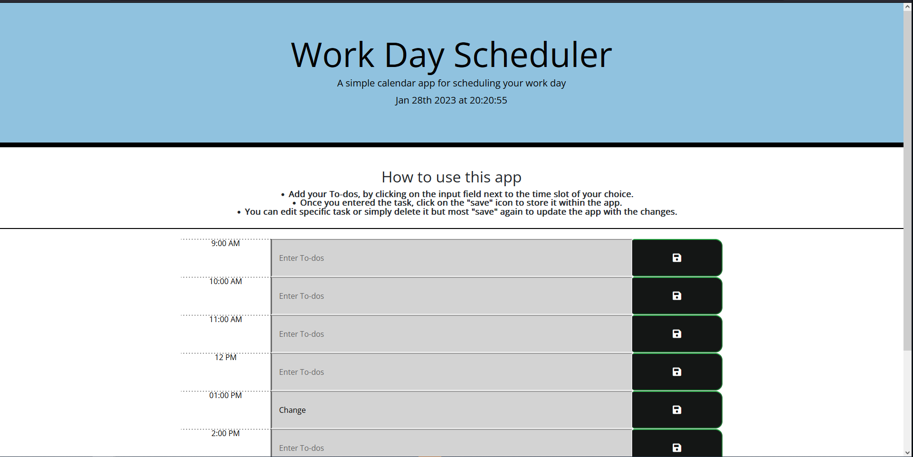

# Daily Planner App

## Overview

This Daily Planner App is designed to help users easily organize and schedule their day. 

When the user opens the planner, the current day is displayed at the top of the calendar. When the user scrolls down, timeblocks for standard business hours are presented. Each timeblock is color-coded based on whether it is in the past, present, or future when viewed.

Users can enter an event by clicking on a timeblock. When the save button is clicked in that timeblock, the event is saved in local storage and will persist between refreshes of the page.

## Deployed site

This site is deployed using [GitHub Pages](https://pages.github.com/)
at https://kifeakor22.github.io/daily-planner/

## Features
- Display the current day at the top of the calendar when a user opens the planner.
- Present timeblocks for standard business hours when the user scrolls down.
- Color-code each timeblock based on past, present, and future when the timeblock is viewed.
- Allow a user to enter an event when they click a timeblock.
- Save the event in local storage when the save button is clicked in that timeblock.
- Persist events between refreshes of a page.

## Technologies Used
- HTML
- CSS
- JavaScript
- Local Storage

## Getting Started

To use this Daily Planner App, simply clone the repository and open the index.html file in a web browser. No additional setup is necessary.

## Contributing

If you would like to contribute to this project, please fork the repository and submit a pull request.

## Support

If you have any questions or issues with the Daily Planner App, please open an issue in this repository.
